  <!-- 01 — HERO SECTION -->
  

    
  
    

  <!-- 02 — DEVELOPER SYSTEM // TAHIR_OS -->
  

    
  
    

  <!-- 03 — PROJECT GALAXY -->
  

    
  
    

  <!-- 04 — CONTRIBUTION SNAKE -->
  

    
  
    

  <!-- 05 — BUILDER MINDSET -->
  

    
  
    

  <!-- 06 — CONNECTION -->
  

   

  → [GitHub](https://github.com/tahirazeem145) &nbsp;·&nbsp; → [LinkedIn](https://in.linkedin.com/in/tahirazeem-r) &nbsp;·&nbsp; → [Email](mailto:tahirazeems145s@gmail.com) &nbsp;·&nbsp; → [Portfolio](https://tahirazeemportfolio.vercel.app)

